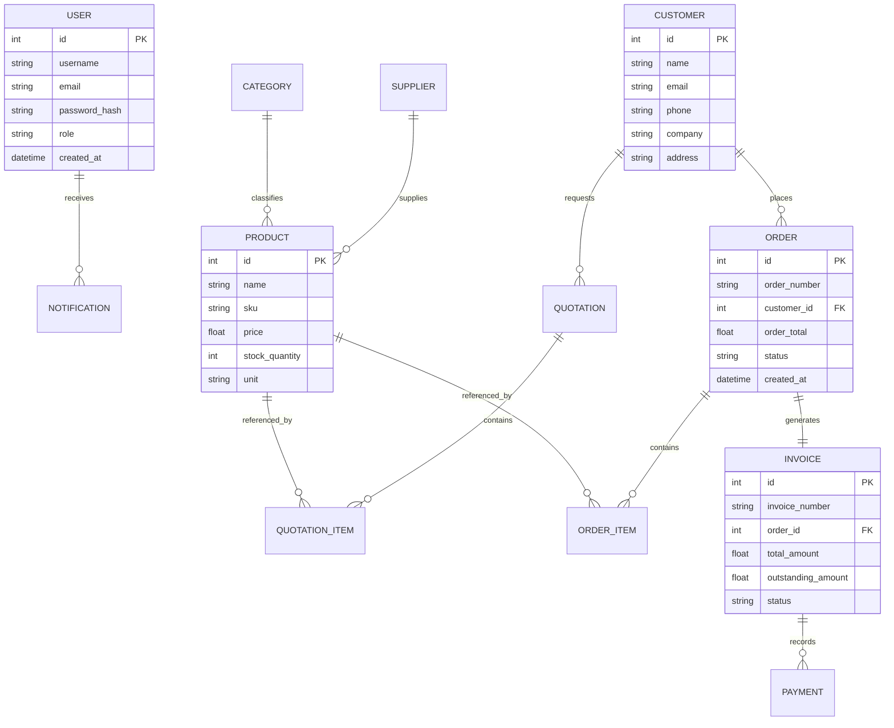

# SalesERP - Full Stack Sales & Order Management System

SalesERP is a production-ready, full-stack ERP web application designed to automate customer relationship management (CRM), inventory cataloging, quotation processing, order fulfillment, automated invoicing, payments ledgers, and sales reports analytics.

---

## 🌟 Key Features

1. **Dual-Portal Custom Styling & Themes:**
   * **Sales Portal (Blue-Teal):** Tailored for daily operations by Sales Managers and Sales Representatives.
   * **Admin Console (Dark-Charcoal & Tech-Red):** A system console for Administrators to audit users, assign role privileges, and check system telemetries.
2. **Secure JWT Authentication & Dynamic RBAC:**
   * Restricts endpoints and menu actions based on user roles (`Admin`, `Sales Manager`, `Employee`).
   * Front-end dynamically strips restricted navigation nodes (e.g., Employees cannot access Invoices, Payments, or Reports).
3. **Automated Stock Telemetry & Alerts:**
   * Confirmed orders automatically deduct inventory stock levels.
   * Emits live warnings and indicators if stock falls below limits.
4. **Professional File Export Services:**
   * **ReportLab PDF:** Compiles clean, print-ready PDF sheets of Invoices and Quotations with VAT/discount tables.
   * **openpyxl Excel:** Generates analytical spreadsheet ledgers of sales transaction volumes and stock assets.
5. **Fault-Tolerant Startup Checker:**
   * Pre-checks the PostgreSQL database connection socket. If unreachable, it automatically configures and runs a local SQLite fallback database, ensuring maximum portal uptime.

---

## 🛠️ Technology Stack

* **Backend:** Python, Flask, Flask-SQLAlchemy, Flask-JWT-Extended, Waitress (Production WSGI Server), PostgreSQL/SQLite.
* **Frontend:** HTML5, CSS3, Bootstrap 5, JavaScript (ES6+), Chart.js (Interactive analytical charts).
* **Testing:** pytest (Integration & unit test coverage).

---

## 📐 Database Schema



---

## 🚀 Installation & Local Setup

### Option 1: Native Local Installation (SQLite Fallback)
1. **Clone the repository:**
   ```bash
   git clone https://github.com/your-username/Sales-Order-Management-System.git
   cd Sales-Order-Management-System
   ```
2. **Install requirements:**
   ```bash
   pip install -r requirements.txt
   ```
3. **Configure environment:**
   Create a `.env` file in the root directory (use `.env.example` as a template):
   ```ini
   FLASK_APP=app.py
   FLASK_ENV=production
   SECRET_KEY=your_secret_key_here
   JWT_SECRET_KEY=your_jwt_secret_key_here
   ```
4. **Run the server:**
   ```bash
   python app.py
   ```
   *Open your browser and navigate to **[http://127.0.0.1:5000](http://127.0.0.1:5000)***.

### Option 2: Containerized Installation (Docker + PostgreSQL)
1. **Ensure Docker Desktop is running.**
2. **Start the containers:**
   ```bash
   docker-compose up --build
   ```
   *This builds the web application container and launches a PostgreSQL 15 database instance inside a virtual network automatically.*
3. **Access the portal:**
   Go to **[http://localhost:5000](http://localhost:5000)**.

---

## 🧪 Running Automated Tests
Run integration, authentication, and transaction pipeline tests:
```bash
python -m pytest
```

---

## 🔑 Portals Demo Credentials

For testing the split-portal workspaces, register new accounts on the signup screen or log in with these predefined test credentials:

| Username | Password | Role | Target Interface |
| :--- | :--- | :--- | :--- |
| **admin** | `Password123!` | Administrator | **Admin Console** (Dark-Charcoal & Tech-Red theme) |
| **tester** | `Password123!` | Sales Manager | **Sales Portal** (Blue-Teal theme) |
