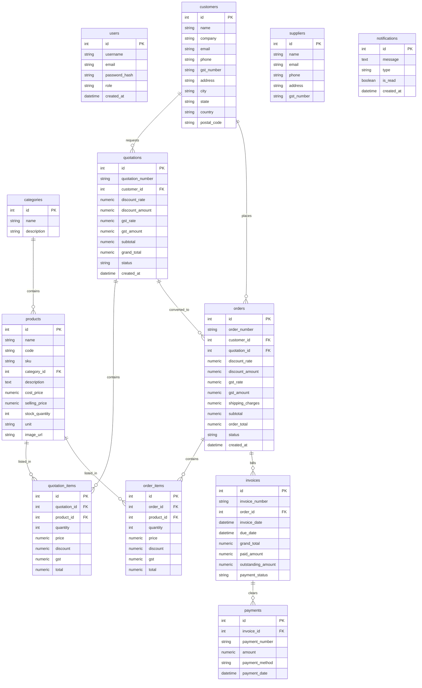

# Enterprise Sales Order Management System (ERP)

A complete, production-ready Full Stack Sales Order Management System (ERP) built following clean MVC architecture, RESTful API design, and SOLID principles. The visual design is inspired by Odoo, featuring a clean blue-and-white theme, sticky sidebar, fluid animations, and real-time analytical charts.

---

## Technical Stack

- **Backend:** Python, Flask, Flask-RESTful, Flask-SQLAlchemy (PostgreSQL / SQLite ORM), Flask-JWT-Extended (Stateful JWT authentication), Flask-CORS, python-dotenv
- **Frontend:** HTML5, CSS3 (Vanilla Custom Theme), Bootstrap 5, Chart.js (CDN), Bootstrap Icons
- **Reports:** ReportLab (Dynamic PDF Invoicing), Openpyxl (Audited Excel Sheets Exports)
- **Deployment:** Docker, Docker Compose, Gunicorn

---

## Database ER Diagram (Relational Schema)

The database schema is fully relational, utilizing foreign keys, cascading deletes, indexing on query-heavy columns, and SQLAlchemy relationships.



---

## Core Features & Workflow

1. **Authentication & RBAC:** Secure login/register with password hashing. First registered user automatically becomes `Admin`. Other roles include `Sales Manager` and `Employee`.
2. **Quotation to Order Pipeline:**
   - Employees generate **Quotations** (GST & discounts calculated in lines).
   - Managers/Admins **Approve** or **Reject** the quotation.
   - Once Approved, quotations can be converted to **Sales Orders**.
3. **Fulfillment & Inventory Checks:**
   - Sales Orders start as `Pending`.
   - Transitioning to `Confirmed` checks stock levels, decrements product inventory, alerts for low stock levels, and **auto-creates a pending Customer Invoice**.
   - Rolling back or Cancelling restores the inventory stock.
4. **Billing & Payments:**
   - Invoices track grand totals, paid volumes, and outstanding balance rates.
   - Record partial/complete payments via cash, credit cards, UPI, or transfers.
5. **PDF & Spreadsheet Exports:**
   - Instantly print/download corporate PDF sheets for invoices and quotations.
   - Download complete sales records summaries and inventory valuation list spreadsheets into Microsoft Excel formatting.

---

## Installation & Setup Guide

### Option 1: Native Local Setup (Recommended for testing)

The application will **automatically fall back to a local SQLite database** if no PostgreSQL connection is defined, making local verification instant.

1. **Clone the Repository** and navigate into the folder.
2. **Install Python Dependencies:**
   ```bash
   pip install -r requirements.txt
   ```
3. **Create Environment Configuration:**
   Copy `.env.example` to `.env` and adjust the variables if needed. Leave `DATABASE_URL` blank to use the local SQLite database fallback.
4. **Start the Application:**
   ```bash
   python app.py
   ```
5. **Access the Portal:**
   Open [http://localhost:5000](http://localhost:5000) in your web browser.

### Option 2: Docker Setup

To spin up both the web application container and PostgreSQL database container:

```bash
docker-compose up --build
```
The portal will be running on [http://localhost:5000](http://localhost:5000).

---

## REST API Documentation

All api endpoints are protected by JWT Bearer tokens, except authentication. Prefix headers with `Authorization: Bearer <token>`.

### Authentication
- `POST /api/auth/register` - Create user account
- `POST /api/auth/login` - Authenticate credentials, returns JWT access token
- `GET /api/auth/me` - Profile lookup
- `POST /api/auth/forgot-password` - Trigger reset workflow instructions

### Customer CRM
- `GET /api/customers` - Fetch registry (supports pagination and queries `?search=Client`)
- `POST /api/customers` - Add client card details
- `PUT /api/customers/<id>` - Update client card profile
- `DELETE /api/customers/<id>` - Delete card profile (Admin/Manager only)

### Catalog & Categories
- `GET /api/products` - List products catalog (`?search=sku&category_id=1`)
- `POST /api/products` - Register catalog product (Admin/Manager only)
- `PUT /api/products/<id>` - Update catalog details (Admin/Manager only)
- `DELETE /api/products/<id>` - Delete catalog product (Admin/Manager only)
- `GET /api/categories` - List categories
- `POST /api/categories` - Create product category

### Transactions & Billing
- `GET /api/orders/quotations` - Fetch quotations list
- `POST /api/orders/quotations` - Create quotation line items
- `POST /api/orders/quotations/<id>/approve` - Approve quotation (Admin/Manager only)
- `POST /api/orders/quotations/<id>/convert` - Convert approved quote to order
- `GET /api/orders/orders` - Fetch sales orders list
- `PUT /api/orders/orders/<id>/status` - Adjust order status (`Confirmed`, `Packed`, `Shipped`, `Delivered`)
- `GET /api/invoices` - Fetch billing register list
- `GET /api/invoices/<id>/pdf` - Print/download PDF invoice
- `POST /api/payments` - Log payment receipt

### Analytics & Reports
- `GET /api/reports/dashboard` - Dashboard analytical aggregates
- `GET /api/reports/sales` - Top customers details
- `GET /api/reports/export/sales` - Export Excel Sales order sheet (Admin/Manager only)
- `GET /api/reports/export/inventory` - Export Excel Stock asset sheet (Admin/Manager only)

---

## Testing Guide

To execute the unit and integration tests covering user roles, workflows, database models, calculations, and stock deductions:

```bash
pytest
```

---

## Deployment Guide

### Deploying to Render
1. Create a **PostgreSQL Database** on Render. Copy the Internal Database URL.
2. Create a **Web Service** on Render, linking it to your GitHub repository.
3. In **Environment Variables**, configure:
   - `DATABASE_URL`: Set to the PostgreSQL URL from step 1.
   - `SECRET_KEY`: Set to a strong secret string.
   - `JWT_SECRET_KEY`: Set to a strong secret string.
   - `FLASK_ENV`: `production`
   - `PORT`: `10000` (Render's default port)
4. Set the **Build Command** to: `pip install -r requirements.txt`
5. Set the **Start Command** to: `gunicorn app:app` (ensure `gunicorn` is in `requirements.txt` if needed, or simply run `python app.py`).

### Deploying to Railway
1. Click **New Project** -> **Deploy from GitHub**.
2. Click **Add Plugin** -> **PostgreSQL**.
3. Under variables in your Web service config, reference the database URL:
   - `DATABASE_URL`: `${{Postgres.DATABASE_URL}}`
   - `SECRET_KEY`: your secret key
   - `JWT_SECRET_KEY`: your jwt key
   - `FLASK_ENV`: `production`

### Deploying to AWS (Elastic Beanstalk)
1. Initialize an Elastic Beanstalk workspace: `eb init -p python-3.11 sales-erp-app`
2. Create an RDS PostgreSQL database instance on AWS.
3. Configure the environment variables in Beanstalk console: `SECRET_KEY`, `JWT_SECRET_KEY`, and `DATABASE_URL` pointing to the RDS endpoint.
4. Deploy the application: `eb create sales-erp-env`
